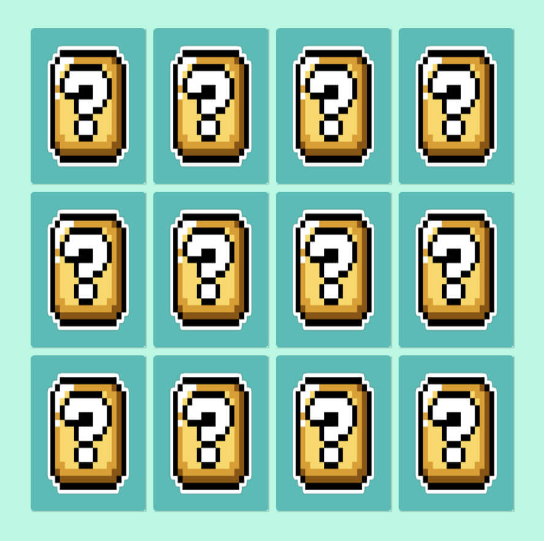
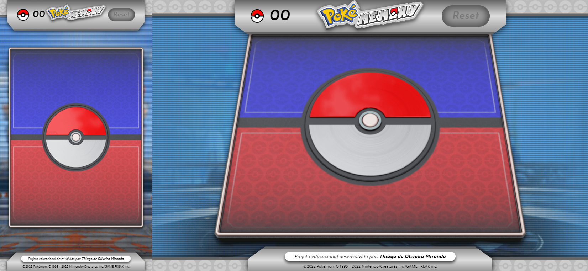
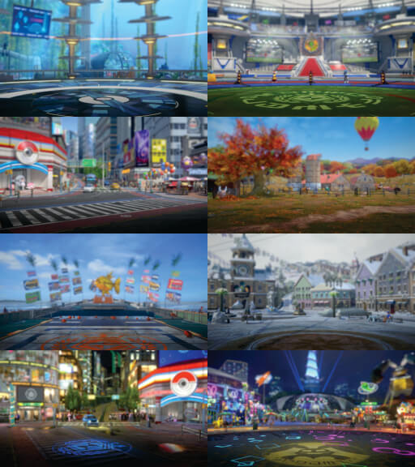

PROJETO EDUCACIONAL PARA O BOOTCAMP DA DIO: 

**Desenvolvido por:** *Thiago de Oliveira Miranda*

***

<h2 align="center">

  **O JOGO DA MEMÓRIA  ( *Versão Pokemon* )**

</h2>

<spam align="center">

https://thiagoomiranda.github.io/poke-memory/ 

</spam>

***

&emsp;&emsp;O exercício proposto consistia em recriar o jogo da *memória*, com o intúito de aplicar conceitos de programação em Javascript. O aprimoramento em Javascript nesta atividade se deu através da aplicação dos métodos ***forEach***, para iterar em conjuntos de elementos do *DOM (Document Object Model)*, seletores do tipo ***querySelector*** que também foram empregados para selecionar grupos de elementos através de classes e tags e o uso da palavra reservada ***this*** em funções de monitoramento de eventos ***eventListeners***, onde a atribuição do elemento era definida no momento do clique.

***

 

### **Exercício apresentado:**

 

<i>Figura 01: Tela da atividade.</i>

 

***

&emsp;&emsp;Parte importante e adicional da atividade é customizar o código, adicionando melhorias e características próprias com ênfase no aprendizado e na aplicação de novos métodos e funções do Javascript,CSS e HTML. 
&emsp;&emsp;Foi escolhido tematizar o jogo com a franquia Pokemon. Todos os gráficos utilizados na página foram adaptados ao design apropriado para o tema e algumas técnicas de *CSS* foram aplicadas para simular a perspectiva em 3D. O uso da biblioteca externa **Vanila Tilt** se fez necessária para conferir maior realismo aos cards do jogo com efeitos de *tracking do cursor* e reflexos nos cards.

***

<h2 align="center">

 

 **ATIVIDADE ENTREGUE** 

</h2>

### **Resultado obtido:**

 

<i>Figura 02: Tela do jogo desenvolvido.</i>

 

***

 

### **Aplicação responsiva e adaptada para telas mobiles:**

 

<i>Figuras 03 e 04: Arena mobile (à esquerda) e arena desktop (à direita).</i>

 

***

 

<i>Figuras 05 a 12: Backgrounds aplicados em loop.</i>

 

***

 

**MELHORIAS IMPLEMENTADAS**

 

* [x]  Backgrounds rotativos trocados em loop.              
* [x]  Logomarca em SVG animada com @keyframes no CSS.
* [x]  Placar de melhor resultado "*TopScore*".
* [x]  Marcador de pontos.
* [x]  Botão de reset após o fim do jogo.
* [x]  Arenas diferentes adaptadas para telas e orientações.
* [x]  Tela de título com transições.
* [x]  Animação da distribuição das cartas.
* [x]  Efeito de perspectiva pseudo-3D.
* [x]  Trilhas sonora de abertura, de jogo e de fim do jogo.
* [x]  Efeitos sonoros nas cartas e sons dos pokemons ao encontrar o par.
* [x]  Animação de fim de jogo e tela de fim de jogo.
* [x]  Funcionalidade que identifica se a tela está na orientação retrato.
* [x]  Funcionalidade que gera cores de fundo randômicas para a tela de encerramento.
                                           
 

***

 

**CRÉDITOS**

 

&emsp;&emsp;Este jogo possui caráter didático e educacional,  sem fins comerciais. Todos os direitos sobre a franquia, marca, personagens, gráficos e trilhas sonoras correlatas à Pokemon pertencem à: 

©2022 Pokémon. ©1995 - 2022 Nintendo/Creatures Inc./GAME FREAK inc. TM, ®Nintendo.

 

***

 

***Trilha sonora de título:***

**Title:** A New Adventure!

**Artist:** Remix by Kunning Fox

**Soundcloud:** https://soundcloud.com/kunning-fox/sets/back-to-unova

**Album:** Back to Unova

**Game:** Pokémon Black & Pokémon White

**Composer:** Junichi Masuda

 

***

 

***Trilha sonora do jogo:***

**Title:** Game Corner (Remix)

**Artist:** Remix ND Music

**Soundcloud:** https://soundcloud.com/nd-music-official 

**Game:** Pokémon G / S / C / HG / SS

**Composer:** Junichi Masuda

 

***

 

***Trilha sonora de encerramento:***

**Title:** Victory! (Trainer Battle)

**Artist:** Remix by Kunning Fox

**Album:** Back to Unova

**Game:** Pokémon Black & Pokémon White

**Composer:** Junichi Masuda

 

***

